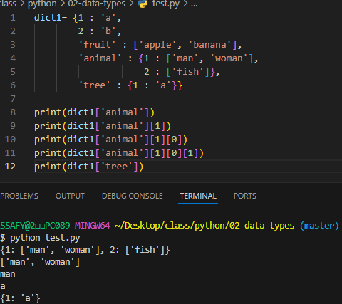
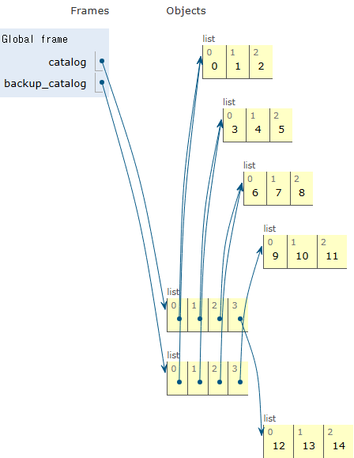
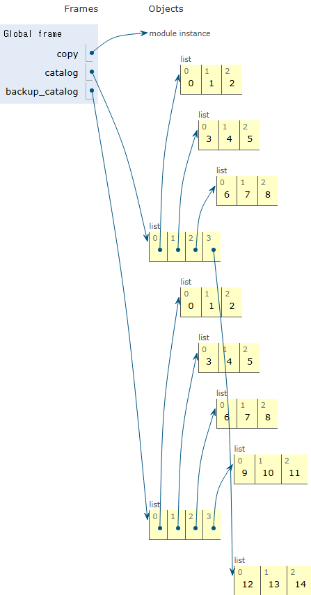
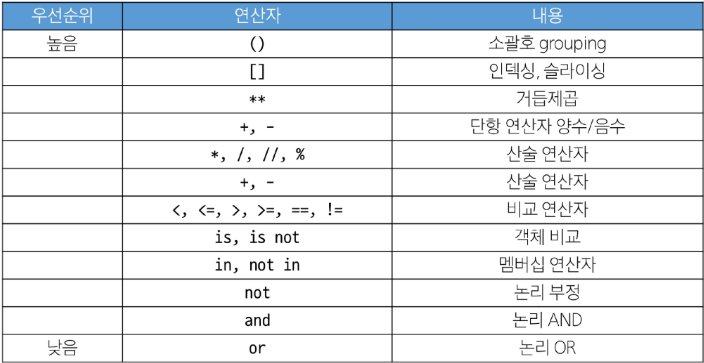

# Python Basic Syntax 2

## List

여러 개의 값을 순서대로 저장하는 변경 가능한(mutable) 시퀀스 자료형

리스트 표현

- 대괄호 [ ] 안에 값들을 쉽표(,)로 구분하여 만듦
- 숫자, 문자열, 심지어 다른 리스트까지 모든 종류의 데이터를 담을 수 있음
- 값을 추가, 수정, 삭제하는 등 자유롭게 변경할 수 있음

### 시퀀스로서의 리스트

**리스트의 시퀀스 특징**

리스트는 시퀀스이므로, 문자열처럼 인덱싱, 슬라이싱, 길이 확인, 반복 등 공통 기능을 모두 사용 가능

### 중첩 리스트 (nested List)

다른 리스트를 값으로 가진 리스트

**중첩 리스트 접근하기**

- 인덱스를 연달아 사용하여 안쪽 리스트의 값에 접근할 수 있음
    - 먼저 바깥 리스트의 인덱스로 안쪽 리스트를 선택
    - 선택된 안쪽 리스트에 다시 한 번 인덱스를 사용

### 리스트

여러 개의 값을 순서대로 저장하는 **변경 가능한(mutable)** 시퀀스 자료형

한번 생성된 리스트는 ‘그 내용을 자유롭게 수정, 추가, 삭제할 수 있다’ → 문자열의 불변성(immutability)과 정반대

## tuple

여러 개의 값을 순서대로 저장하는 **변경 불가능한** 시퀀스 자료형

**튜플 표현**

- 소괄호 ( ) 안에 값들을 쉼표(,)로 구분하여 만듦
- 모든 종류의 데이터를 담을 수 있음
- 리스트와 거의 모든 면에서 비슷하지만 한번 만들어지면 절대 수정할 수 없다는 결정적인 차이가 있음
- 소괄호 없이도 만들 수 있다
    - `tuple1 = 1, 'hello', 3.14, True`
- 단일 요소 튜플을 만들 때는 반드시 Trailing comma (후행 쉼표)를 사용해야 함
    - `tuple2 = (1,)`

### 시퀀스로서의 튜플

인덱싱, 슬라이싱, 길이 확인, 반복 등 공통 기능을 모두 사용할 수 있음

### 튜플의 불변성

- 한번 생성된 튜플은 그 내용을 절대 수정, 추가, 삭제할 수 없음
- 튜플의 불변 특성을 사용하여 내부 동작과 안전한 데이터 전달에 사용됨
- 다중 할당, 값 교환, 함수 다중 반환 값 등
- 데이터의 안정성과 무결성을 보장

## range

- **연속된** 정수 시퀀스를 생성하는 **변경 불가능한**(immutable) 자료형
- 주로 **반복문**과 함께 사용되어 특정 횟수만큼 코드를 반복 실행할 때 매우 유용
- 실제로 모든 숫자를 메모리에 저장하는 대신 시작 값, 끝 값, 간격이라는 ‘규칙’만 기억해 메모리를 매우 효율적으로 사용

### range 기본 구문

- range( )는 1개,2개, 3개의 매개변수(인자)를 가질 수 있다.
    - 매개변수 : 함수를 정의할 때, 함수가 받을 값을 나타내는 변수
    - 인자 : 함수를 호출할 때, 실제로 전달되는 값

### range 매개변수별 특징

- **range(stop)**
    - 매개변수가 하나면 stop으로 인식
    - start는 0이, step은 1이 기본값으로 자동 설정
    - range(5) → 0, 1, 2, 3, 4
- **range(start, stop)**
    - 매개변수가 두 개면 start와  stop으로 인식
    - step은 1이 기본값으로 자동 설정
    - range(2,5) → 2, 3, 4
- **range(start, stop, step)**
    - 모든 매개변수를 직접 지정
    - range(2, 10, 2) → 2, 4, 6, 8

- range는 list로 형변환 시 내부 값을 확인할 수 있다
- 실제로 모든 숫자를 메모리에 저장하는 대신, 시작 값, 끝 값, 간격이라는 ‘규칙’만 기억해 메모리를 효율적으로 사용

### range의 규칙

1. 값의 범위 규칙
- stop 값은 생성되는 시퀀스에 절대 포함되지 않음
    - stop 값 바로 앞에서 시퀀스가 끝난다
- range(1, 5)는 1부터 5 ‘전’까지의 숫자를 의미하므로 1, 2, 3, 4가 생성
1. 증가/감소 값(step) 규칙
- step값은 숫자 시퀀스의 간격과 방향을 결정
    - step이 양수일 때 (기본값:1)
        - 숫자가 start부터 stop을 향해 증가
        - range(1, 10, 2) → 1, 3, 5, 7, 9
        - 시작 값이 끝 값보다 작은 경우 (정상)
            
            > print(list(range(1, 5))) #[1, 2, 3, 4]
            > 
        - 시작 값이 끝 값보다 큰 경우
            
            > print(list(range(5, 1))) #[ ]
            > 
    - step이 음수일 때
        - 숫자가 start부터 stop을 향해 감소
        - 이 경우, start 값은 stop 값보다 반드시 커야 함
        - range(10, 1, 02) → 10, 8, 6, 4, 2
        - 시작 값이 끝 값보다 작은 경우 (정상)
            
            > print(list(range(5, 1, -1))) # [5, 4, 3, 2]
            > 
        - 시작 값이 끝 값보다 큰 경우
            
            > print(list(range(1, 5, -1))) # [ ]
            > 

## dict

**딕셔너리** : Key - value 쌍으로 이루어진 순서와 중복이 없는 변경 가능한 자료형

### 딕셔너리 표현

- 중괄호 { } 안에 값들이 쉼표(, )로 구분되어 있음
- 값 1개는 키와 값이 쌍으로  이루어져 있음
- key(키) : 값을 식별하기 위한 고유한 ‘이름표’ (**중복 불가**)
- Value(값) : 키에 해당하는 실제 데이터
- 각 값에는 순서가 없음

**※ 딕셔너리의 순서**

- 딕셔너리는 순서가 없는 자료형이지만 파이썬 3.7 이상에서는 입력한 순서는 출력시 그대로 유지된다
- BUT 딕셔너리의 핵심은 ***순서가 없는 자료형***이라는 점과 ***Key를 통한 접근***이라는 점을 기억하자

### 딕셔너리 규칙

**Key의 규칙**

- 고유해야 함
    - Key는 중복될 수 없음
- 변경 불가능한(imautable) 자료형만 사용 가능
    - O (가능) : `str`, `int`, `float`, `tuple`
    - X (불가능) : `list`, `dict`

**Value의 규칙**

- 어떤 자료형이든 자유롭게 사용할 수 있음

### 딕셔너리 값 접근

- Key를 사용해 해당 Value를 꺼내올 수 있음
- Key에 접근시 대괄호 [ ] 사용

※ 존재하지 않는 Key로 접근하면 KeyError가 발생하며 프로그램이 멈춘다

※ 사전에서 단어(Key)를 찾아 뜻(Value)를 확인하는 것처럼 딕셔너리는 Key를 통해 Value에 빠르게 접근한다

- 딕셔너리 값 추가 및 변경

※ 딕셔너리를 사용할 때 : 데이터에 순서가 필요 없고, 각 데이터에 의미 있는 이름(Key)를 붙여 관리하고 싶을 때 사용 (ex. 사람의 인적 정보, 게임 캐릭터의 능력치 등)



## Set

순서와 중복이 없는 변경 가능한 자료형

**세트 표현**

- 중괄호 { } 안에 값들을 쉼표(,)로 구분하여 만듦
- 수학에서의 집합과 동일한 연산 처리 가능

**세트의 두 가지 핵심 특징**

- 중복을 허용하지 않음
    - 똑같은 값은 단 하나만 존재할 수 있음
- 순서가 없음
    - 인덱싱(set[0])이나 슬라이싱(set[0:2])을 사용할 수 없음

※ 비어있는 딕셔너리와의 혼동을 피하기 위해 비어있는 세트는 반드시 set() 함수로 만들어야 함.

`my_set_1 = set( )`

### 세트의 집합 연산

두 데이터 그룹 간의 관계를 파악하는 데 효과적

합집합 : `print(my_set_1 | my_set_2)` → 기호 : `|`

차집합 : `print(my_set_1 - my_set_2)` → 기호 : `-`

교집합 : `print(my_set_1 & my_set_2)` → 기호 : `&`

## Other Types

### None

- 파이썬에서 ‘**값이 없음**’을 표현하는 특별한 데이터 타입
- 내용물이 없는 ‘빈 상자’
- 숫자 0이나 빈 문자열(’ ‘)과는 다른 ‘**값이 존재하지 않음**’ 또는 ‘**아직 정해지지 않음**’이라는 상태를 나타내기 위해 사용됨
- 아직 아무 값도 할당하고 싶지 않을 때
- 표현 : `my_variable = None`

### Boolean

- ‘참(True)’과 ‘거짓(False)’ 단 두 가지 값만 가지는 데이터 타입
- ‘ON / OFF’ 스위치처럼 프로그램의 흐름을 제어하는 조건문에서 ‘맞다 / 틀리다’를 판단하는 역할
- 표현 : 비교 / 논리 연산의 평가 결과로 사용됨 `True` / `False`
- 주로 조건 / 반복문과 함께 사용됨

## Collection

- 여러 개의 값을 하나로 묶어 관리하는 자료형을 통칭하는 말
- 여러 물건을 담는 ‘보관함’과 같으며, 파이썬은 목적에 따라 다양한 종류의 컬렉션을 제공
- `str`, `list`, `tuple`, `range`, `set`, `dict` 데이터 타입이 모두  Collection에 분류
- 

| 컬렉션명 | 변경 가능 여부 | 순서 존재 여부 |
| --- | --- | --- |
| str | X | O |
| list | O | O |
| tuple | X | O |
| dict | O | X |
| set | O | X |

### 불변 vs 가변

| 구분 | 불변 (Immutable) | 가변 (Mutable) |
| --- | --- | --- |
| 특징 | 변경 불가, 안전성, 예측 가능 | 변경 가능, 유연성, 효율성 |
| 종류 | str, tuple, range | list, dict, set |

*※ 가변에서 얕은 복사 vs 깊은 복사를 나중에 배울 것*

[가변 객체, 불변 객체](https://docs.python.org/ko/3.13/reference/datamodel.html)

※ 얕은 복사  
copy.()
```
catalog = [
    [0, 1, 2],
    [3, 4, 5],
    [6, 7, 8],
    [9, 10, 11],
]

backup_catalog = catalog.copy()


catalog[3] = [12, 13, 14]
print('catalog와 backup_catalog를 비교한 결과')

print(catalog is backup_catalog)

print('backup_catalog : ')
print(backup_catalog)
print()

print('catalog : ')
print(catalog)
```


※ 깊은 복사  
import copy  
copy.deepcopy(변수명)
```
import copy

catalog = [
    [0, 1, 2],
    [3, 4, 5],
    [6, 7, 8],
    [9, 10, 11],
]

backup_catalog = copy.deepcopy(catalog)


catalog[3] = [12, 13, 14]
print('catalog와 backup_catalog를 비교한 결과')

print(catalog is backup_catalog)

print('backup_catalog : ')
print(backup_catalog)
print()

print('catalog : ')
print(catalog)
```



## 형변환 (Type Conversion)

한 데이터 타입을 다른 데이터 타입으로 변환하는 과정

- 암시적 형변환 : 파이썬이 자동으로 처리
- 명시적 형변환 : 개발자가 직접 지시

### 암시적 형변환 (Implicit Conversion)

- 파이썬이 연산 중에 자동으로 데이터 타입을 변환하는 것
- 데이터 손실을 막기 위해 더 정밀한 타입으로 자동 변환해주는 규칙
- 작은 ‘정수 상자’와 큰 ‘실수 상자’의 내용물을 합칠 때, 더 안전하게 담을 수 있는 큰 ‘실수 상자’로 알아서 옮겨 담는다
- 개발자가 신경 쓰지 않아도 ‘더 안전한 쪽으로’ 파이썬이 처리해 주는 것
- 정수와 실수의 연산에서 정수가 실수로 변환됨
- Bollean과 Numeric Type에서만 가능

### 명시적 형변환 (Explicit Conversion)

- 개발자가 변환하고 싶은 타입을 직접 함수로 지정하여 변환하는 것
- 서로 다른 타입의 데이터를 ‘호환’되도록 맞춘느 과정
- 해외에서 다른 모양의 전기 콘센트에 맞는 ‘어댑터’를 끼우는 것
- 파이썬은 타입에 엄격해서 정수와 문자열을 바로 더할 수 없는 것처럼 모양이 다른 플러그는 바로 연결할 수 없음
- `str` → `int` : 형식에 맞는 숫자만 가능
- `int` → `str` : 모두 가능

|  | str | list | tuple | range | set | dict |
| --- | --- | --- | --- | --- | --- | --- |
| str |  | O | O | X | O | X |
| list | O |  | O | X | O | X |
| tuple | O | O |  | X | O | X |
| range | O | O | O |  | O | X |
| set | O | O | O | X |  | X |
| dict | O | O(Key만) | O(Key만) | X | O(Key만) |  |

## 연산자

### 산술연산자

수학적 계산을 위해 사용되는 연산자

### 복합 연산자

연산과 할당이 함께 이뤄짐

`+=` : a += b ⇒ a = a + b

`_=` : a -= b ⇒ a = a - b

### 비교 연산자

두 값을 비교하여 그 관계가 맞는지 틀리는지를  True 또는 False로 반환

`==` → 같음

- 값(데이터)이 같은지를 비교
- 동등성 (equality)
- 1 == True의 경우 파이썬이 내부적으로  True를 1로 간주할 수 있으므로(암시적 형변환) True 결과가 나옴
- 수의 비교에서는 사용하지 ㅇ낳음

`!=` → 같지 않음

`is` → 같음

- 객체 자체가 같은지를 비교
- 식별성 (Identity)
- 두 변수가 완전히 동일한 객체를 가리키는지, 즉 메모리 주소가 같은지를 확인할 때 사용

`is not` → 같지 않음

**`is` 대신 `==`를 사용해야 하는 이유**

- `is`는 ‘정체성’을, `==`는 ‘가치’를 비교하기 때문
- 두 연산자는 ‘같다’를 확인하는 목적이 근본적으로 다름
- `is` (Identity Operator) : 두 변수가 완전히 동일한 메모리 주소의 객체를 가르키는지, 즉 ‘정체성(Identity)’이 같은지를 확인
- `==` (Equality Operator) : 두 변수가 가리키는 객체의 내용, 즉 ‘값(value)’이 같은지를 확인

`is`를 값 비교에 사용하면 안 되는 이유 : 의도와 다른 결과를 낳는다

`is` 연산자는 언제 사용하는가? : 주로 싱글턴 객체를 비교할 때 사용

- 싱글턴(Singleton) 객체란?
    - 특정 값에 대해 파이썬 전체에서 **단 하나의 객체만 생성되어 재사용**되는 특별한 객체
    - 여러 변수가 이 값을 가지더라도, 모두 **미리 만들어진 하나의 객체**를 함께 가리키게 되므로 항상 같은 메모리 주소를 가짐
    - `None`, `True`, `False`

※ 리스트나 객체 비교 시 주의사항

- 리스트 또는 다른 가변 객체(mutable)를 비교할 때, 값 자체가 같은 지 확인하려면 `==` 사용
- 두 변수가 완전히 동일한 객체를 가리키는지를 확인하려면 `is` 사용

**정리**

- 값 비교에는 `==`를 사용하고 객체(레퍼런스) 비교에는 `is`를 사용하는 것이 원칙
- 숫자나 문자열, 불리언 값 등 동등성(값)을 판단해야 할 때 `is`를 쓰면 의도치 않은 결과 (False)가 나올 수 있으며, 이는 파이썬 내부적인 최적화나 타입 차이로 인해 일관성이 깨질 수 있기 때문
- `is`는 주로 싱글턴 객체에 대한 비교 시 사용

### 논리 연산자

여러 개의 조건을 조합하거나 True/False 값을 반대로 뒤집을 때 사용 (and, or, not이 대표적)

`and` : 논리곱 - 두 피연산자 모두 True 인 경우에만 전체 표현식을 True로 평가

`or` : 논리합 - 두 피연산자 중 하나라도 True인 경우 전체 표현식을 True로 평가

`not` : 논리부정 - 단일 피연산자를 부정

### 단축 평가

- 논리 연산에서 두 번째 피연산자를 평가하지 않고 결과를 결정하는 동작
- 컴퓨터는 똑똑한 게으름으로 꼭 필요한 계산만 하고, 결과가 이미 정해졌다면 굳이 뒤에 있는 코드까지 확인하지 않는다
- 결과가 확정되는 순간 평가를 ‘단축’하고 넘어간다고 해서 ‘단축 평가’라고 부른다
- ‘참(True)’과 ‘거짓(False)’에 대한 새로운 시각
    - 단축 평가를 이해하려면, 파이썬이 어떤 값을 ‘참’으로 보고 어떤 값을 ‘거짓’으로 보는지 알아야 함
- 거짓으로 취급되는 값들
    - `False`, `숫자 0`, `빈 문자열 " "`, `빈 리스트 [ ]`, `None` 등 ‘비어있거나 없다’는 느낌의 값들
- 참으로 취급되는 값들
    - `True`그리고 ‘거짓’이 아닌 모든 값
    - `1`, `-10`, `"hello"`, `[1, 2]` 등 내용이 있는 값
- 단축 평가 동작 정리
    - and 연산자
        - 하나라도 ‘거짓’이면 바로 ‘거짓’
        - and는 연산을 왼쪽에서 오른쪽으로 진행하다가 처음 만나는 ‘거짓’ 값을 바로 반환
        - 만약 끝까지 갔는데 모든 값이 ‘참’이면, 맨 마지막 ‘참’ 값을 반환
    - or 연산자
        - 하나라도 ‘참’이면 바로 ‘참’
        - or는 연산을 왼쪽에서 오른쪽으로 진행하다가, 처음 만나는 ‘참’값을 바로 반환
        - 만약 끝까지 갔는데 모든 값이 ‘거짓’이면 맨 마지막 ‘거짓’값을 반환

### 멤버십 연산자

특정 값이 시퀀스나 다른 컬렉션 안에 포함되어 있는지 확인하는 연산자

`in` : 왼쪽 피연산자가 오른쪽 피연산자의 시퀀스에 속하는지를 확인

`not in` : 왼쪽 피연산자가 오른쪽 피연산자의 시퀀스에 속하지 않는지를 확인

### 시퀀스형 연산자

- 시퀀스 자료형(문자열, 리스트, 튜플)에 특별한 의미로 사용되는 연산자
- `+`는 시퀀스를 연결하는 기능을, `*`는 시퀀스를 반복하는 기능을 함

### 연산자 우선순위



## Trailing Comma

- 컬렉션의 마지막 요소 뒤에 붙는 쉼표
- Trailing Comma 작성은 ‘선택사항’
- 단, 하나의 요소로 구성된 튜플을 만들 때는 필수
- 각 요소를 별도의 줄에 작성
- 마지막 요소 뒤에 Trailing Comma 추가
- 닫는 괄호는 새로운 줄에 배치

### Trailing Comma 장점

- 가독성 향상
    - 각 줄이 동일한 패턴을 가짐
    - 코드 리뷰가 용이함
- 유지보수 용이성
    - 항목 추가/제거가 간단
    - 실수로 인한 구문 오류 방지